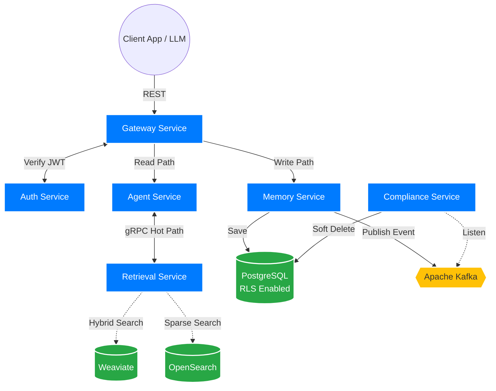

# Distributed AI Memory System (DAMS)

[](https://www.oracle.com/java/technologies/javase/jdk21-archive-downloads.html)
[](https://spring.io/projects/spring-boot)
[](#license)

DAMS is a production-grade, enterprise-ready **Distributed AI Memory System** designed to provide AI agents with persistent long-term memory, semantic recall, and automated lifecycle management. It bridges the gap between transient LLM contexts and persistent knowledge storage.

## Key Features

- **Semantic Recall & Hybrid Search**: Combines dense vector search (Weaviate) with sparse BM25 search (OpenSearch) and cross-encoder re-ranking for ultra-precise retrieval.
- **Automated Memory Lifecycle**: Intelligent ranking (recency/frequency/salience), automated summarization, and pruning engines.
- **Enterprise-Grade Security**: Multi-tenant isolation enforced via JWT and PostgreSQL Row-Level Security (RLS).
- **Compliance First**: Built-in GDPR erasure pipelines and immutable audit logging.
- **Scalable Architecture**: Event-driven write path (Kafka) and high-performance synchronous read path (gRPC/REST).

## Architecture

DAMS follows a microservices architecture built on **Java 21** and **Spring Boot 3.3**.



### Service Map

| Service | Responsibility |
| :--- | :--- |
| **Gateway** | API routing, JWT validation, and per-tenant rate limiting. |
| **Auth Service** | Identity management, token issuance, and memory-level ACL. |
| **Memory Service** | Core CRUD operations, versioning, and conflict resolution. |
| **Retrieval Service** | Query rewriting (HyDE), hybrid search, and context budgeting. |
| **Embedding Service** | Vector generation and batch reindexing pipelines. |
| **Ranking Engine** | Heuristic importance scoring (Recency + Frequency + Salience). |
| **Pruning Engine** | Soft-delete management and memory summarization. |
| **Compliance Service** | GDPR orchestration and immutable audit logs. |
| **Agent Service** | LLM orchestration and memory context injection. |

### Data Flow
1. **Write Path (Async)**: `Client` → `Gateway` → `Memory Service` → `Kafka` → `Embedding Service` → `Vector DB`.
2. **Read Path (Sync)**: `Agent Service` → `Retrieval Service` → `Hybrid Search` → `Re-ranking` → `Context Budgeting`.

## Tech Stack

- **Runtime**: Java 21 (LTS), Spring Boot 3.3.x
- **Database**: PostgreSQL 16 (Primary), Weaviate 1.24 (Vector), OpenSearch 2.12 (Sparse)
- **Messaging**: Apache Kafka 3.6
- **Caching**: Redis 7.2
- **Observability**: Prometheus, Grafana, Jaeger (OTLP)
- **Deployment**: Kubernetes, Docker, Terraform

## 🚦 Getting Started

### Prerequisites
- JDK 21+
- Docker Desktop
- Gradle 8.7+

### Local Infrastructure
Start the supporting infrastructure using Docker Compose:
```bash
docker compose up -d
```

### Build & Run
Compile all services and generate artifacts:
```bash
./gradlew build
```

To run a specific service (e.g., Memory Service):
```bash
./gradlew :memory-service:bootRun
```

## Security & Compliance
- **Tenant Isolation**: Every database query is scoped by `tenant_id` using PostgreSQL RLS.
- **JWT Claims**: `tenant_id` and `user_id` are extracted from secure JWT claims, never trusted from request bodies.
- **GDPR**: Supports full data erasure within 72 hours and comprehensive data exports.

## Observability
All services expose metrics via Spring Actuator at `/actuator/prometheus`.
- **Dashboards**: Pre-configured Grafana dashboards are available in `k8s/grafana-dashboard.json`.
- **Tracing**: Distributed tracing is handled via OpenTelemetry and can be viewed in Jaeger at `http://localhost:16686`.

## Documentation
- [Technical Specification](PRD.md) - Deep dive into functional requirements and data patterns.
- [docs/adr/](docs/adr/) - Architecture Decision Records.
- [docs/runbooks/](docs/runbooks/) - Operational guides for reindexing and compliance.

## Contributing
Please see `CLAUDE.md` for specific development guidelines, coding standards, and build commands.

---
© 2026 AI Memory Systems Enterprise. All rights reserved.
